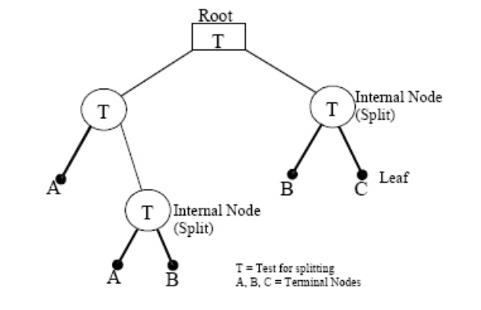
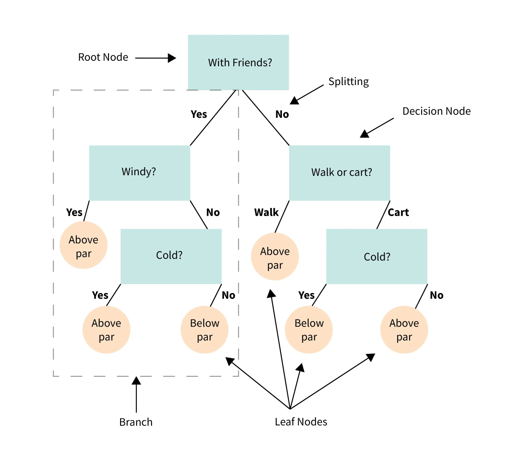

class: class: center, middle


<!-- css: [default, duke-blue, hygge-duke] -->

```{r setup, echo=FALSE}
options(htmltools.dir.version = FALSE)
xaringanExtra::use_logo('www/channels4_profile-removebg-preview.png')
```

```{r include=FALSE}
library(dplyr)
knitr::opts_chunk$set(warning = FALSE, message = FALSE)
```

```{css, echo = F}
.regression table {
  font-size: 12px;     
}

.dataTables_info{
  font-size: 10px;
}

.dataTables_paginate{
  font-size: 10px;
}

.dataTables_length{
  font-size: 10px;
}
```


# Machine Learning

---

# Machine Learning - Concepts

- Machine Learning (ML) is a subset of Artificial Intelligence (AI)
- Algorithms that can improve automatically through experience and by the use of data without being explicit programmed, reason why we say that the algorithms learn.
- With ML algorithms we can build a model to make predictions or decisions.
- Machine learning algorithms are used many different applications, for example:
  - Medicine
  - Email filtering
  - Speech recognition
  - Computer vision

<center></img></center>

---

class: center, middle
background-image: url(www/machine-learning.png)
background-size: contain

---

class: center, middle

# Supervised Learning

---

# Supervised Learning

.pull-left[
**Supervised learning** is where you have input variables ($X$) and an output variable ($y$) and you use an algorithm to learn the mapping function from the input to the output.

<center> y = f(X) </center>

- It is the most common type of Machine Learning problem

- It is called **supervised** because we have the label that tell us the correct information, and we are going to be corrected if we predict wrong.

- Supervised learning can be grouped into two problems:
  - **Regression:** The output variable is a real number, for example, weight
  - **Classification:** The output variable is a category, for example, disease and no disease 
]

.pull-right[
</img>
]

---

class: center, middle

# Classification

---

# Classification

**Classification** is a type of **supervised** learning where we categorise data into classes. There are many different algorithms that can help us solve this kind of problems.

Classification requires a training dataset with many examples of inputs and outputs from which to learn. It can be categorised in two types of problems:
  - **Binary classification:** The outcome has only **two** labels, for example, disease and not disease. 
    - Some popular algorithms are: Logistic Regression, Decision Tree, K-Nearest Neighbour (KNN)
  - **Multi-label classification:** The outcome has multiple labels, for example, dog, cat, bird and other.
    - Some popular algorithms: KNN, Decision Tree, Random Forest, Naive Bayes

To evaluate the model performance we can make use of ROC, confusion matrix, etc. We need to be aware of **class imbalance** problems.

---

class: center, middle

# Decision Tree (CART)

---

# Decision Tree

There are various algorithms that can grow a tree. 
- Differences: 
  - Possible structure of the tree (e.g. number of splits per node)
  - Criteria how to find the splits
  - Criteria to stop splitting 
  - How to estimate the simple models within the leaf nodes. 
  
The **Classification and Regression Trees (CART)** algorithm is probably the most popular algorithm for tree induction. 
  - We will focus on CART, but the interpretation is similar for most other tree types.
  
> Note: Decision Trees can be used for both Regression and Classification problems

---

# Theory

The processes behind *classification* and *regression* in tree analysis is very similar, but we need to first distinguish the two.

- **Classification:** For a response variable which has *classes*, we want to organize the dataset into groups by the response variable. 
- **Regression:** When our response variable is instead numeric or continuous we
wish to use the data to predict the outcome, and will use regression trees in this situation. 

Essentially, a classification tree splits the data based on homogeneity by categorizing the data based on similarity, filtering out the "noise" and making the data "pure", hence the concept of **purity criterion**. 

When the response variable does not have classes, a regression model is fit to each of the independent variables, isolating these variables as nodes where their inclusion decreases error. 

<!-- --- -->

<!-- # Theory - Regression -->

<!-- .pull-left[ -->
<!-- In traditional regression models, we have a single model to represent the entire data set. CART is an alternative approach to this, where the data is -->
<!-- partitioned into smaller sections where variable interactions are more clear. -->

<!-- CART uses this recursive partitioning to create a tree where each node represents a cell of the partition. Each cell has attached to it a simplified model which is applied to that cell only, and as we move down the nodes, or leaves, of the tree we are conditioning on a certain variable.  -->

<!-- In the figure, A, B, and C are each terminal nodes, implying that after this split, further splitting does not explain enough of the variance to be relevant in describing Y. -->
<!-- ] -->

<!-- .pull-right[ -->
<!-- </img> -->
<!-- ] -->

<!-- --- -->

---

# Theory

CART takes a feature and determines which cut-off point minimizes:
- The variance of $Y$ for a regression task 
  -  The variance tells us how much the y values in a node are spread around their mean value
- The Gini index of the class distribution of $Y$ for classification tasks
  - The Gini index tells us how "impure" a node is, e.g. if all classes have the same frequency, the node is impure, if only one class is present, it is maximally pure. 

Variance and Gini index are minimized when the data points in the nodes have very similar values for $Y$. As a consequence, the best cut-off point makes the two resulting subsets as different as possible with respect to the target outcome. 

For categorical features, the algorithm tries to create subsets by trying different groupings of categories. After the best cutoff per feature has been determined, the algorithm selects the feature for splitting that would result in the best partition in terms of the variance or Gini index and adds this split to the tree. The algorithm continues this search-and-split recursively in both new nodes until a stop criterion is reached. Possible criteria are: A minimum number of instances that have to be in a node before the split, or the minimum number of instances that have to be in a terminal node.

---

# Interpretation

.pull-left[

Let's first define some keys terms:
- **Root node:** The base of the decision tree.
- **Splitting:** The process of dividing a node into multiple sub-nodes.
- **Decision node:** When a sub-node is further split into additional sub-nodes.
- **Leaf node:** When a sub-node does not further split into additional sub-nodes; represents possible outcomes.
- **Pruning:** The process of removing sub-nodes of a decision tree.
- **Branch:** A subsection of the decision tree consisting of multiple nodes.

Starting from the root node, you go to the next nodes and the edges tell you which subsets you are looking at. Once you reach the leaf node, the node tells you the predicted outcome. All the edges are connected by 'AND', so we are conditioning on the variable.

]

.pull-right[


For example, if you are with friends *AND* it is windy, *THEN* it is above par.

]
---

# In R

There are two main libraries that implement the CART model:
- tree
  - Command: *tree(formula, data, weights, subset, na.action = na.pass, control = tree.control(nobs, ...), method = "recursive.partition", split = c("deviance", "gini"), model = FALSE, x = FALSE, y = TRUE, wts = TRUE, ...)*
      - **formula** defines if it is classification or regression. It should be entered on the format $Y \sim x_1 + ... + x_n$
      - **data**: Dataset 
- rpart
  - Command: *rpart(formula, data, weights, subset, na.action = na.rpart, method, model = FALSE, x = FALSE, y = TRUE, parms, control, cost, ...)*
      - **method** defines if it is a classification or regression

In summary, if using $tree$ for:
 - **Classification**: $\text{tree}(\text{factor}(Y) \sim \sum x, \text{data})$
 - **Regression**: $\text{tree}(Y \sim \sum x, \text{data})$

If using $rpart$:
- **Classification**: $\text{tree}(Y \sim \sum x, \text{data}, method = 'class')$
- **Regression**: $\text{tree}(Y \sim \sum x, \text{data}, method = 'anova')$

---

# Example

We will use a **classification** dataset for the example. The dataset will be the `Pima Indians Diabetes Database` from `mlbench`.

```{r}
library(rsample)     # data splitting 
library(dplyr)       # data wrangling
library(rpart)       # performing regression trees
library(rpart.plot)  # plotting regression trees
library(mlbench)     # ML datasets

# Pima Indians Diabetes Database
data(PimaIndiansDiabetes)

glimpse(PimaIndiansDiabetes)
```


---

# Example

First, we will split the data into a training and test set

```{r}
# Create training (70%) and test (30%) sets 
# Use set.seed for reproducibility
set.seed(123)
pima_split <- initial_split(PimaIndiansDiabetes, prop = .7)
pima_train <- training(pima_split)
pima_test  <- testing(pima_split)
```

---

# Example - Implementation

I'll fit the example using `rpart` and plot the tree using `rpart.plot`

```{r}
tree <- rpart(formula = diabetes ~ .,
              data = pima_train,
              method = 'class')

tree
```

---

# Explaining the output

The output explains the steps for the split. For example, 
- We start with 537 observations at the root node (very beginning) 
- The first variable we split on (the first variable that optimizes a reduction in the Gini index) is `glucose`. 
- We can see that at the first node all observations with `glucose < 143.5` go to the 2nd (`2)`) branch. 
- The total number of observations that follow this branch (`414`), their probability of not having diabetes is `0.768` and we have `96` negatives. 
  - If you look for the 3rd branch (`3)`) you will see that `123` observations with `glucose >= 143.5` follow this branch and their probability of not having diabetes is 0.26. 
- Basically, this is telling us the most important variable that has the largest reduction in Gini initially is `glucose` with the majority of people having lower glucose values resulting in not having diabetes.

---

# Example - Visualise Tree

We can visualize our model with `rpart.plot` that has many plotting options. One thing you may notice is that this tree contains 13 internal nodes resulting in 14 terminal nodes. 

```{r fig.height=6}
rpart.plot(tree)
```

---

# Explaining the Partitions

You might have noticed that not all the variables were used to generate the plot. 

Behind the scenes `rpart` is automatically applying a range of cost complexity to prune the tree. To compare the error for each value, rpart performs a 10-fold cross validation so that the error associated with a given value is computed on the hold-out validation data. 

In this example we find diminishing returns after 14 terminal nodes as illustrated below. We could use a tree with 3 terminal nodes and reasonably expect to experience similar results within a small margin of error.

```{r fig.height=4}
plotcp(tree)
```

---

# Pruning

By default, `rpart` is performing some automated tuning, with an optimal subtree of 13 splits, 14 terminal nodes, and a cross-validated error of 0.7433. However, we can perform additional tuning to try improve model performance.

```{r fig.height=3}
tree$cptable
```

---

# Tuning

In addition to the cost complexity ($\alpha$ parameter), it is also common to tune:

- **minsplit:** the minimum number of data points required to attempt a split before it is forced to create a terminal node. 
- **maxdepth:** the maximum number of internal nodes between the root node and the terminal nodes. 


```{r}
tree_control <- rpart(
    formula = diabetes ~ .,
    data    = pima_train,
    method  = "class", 
    control = list(minsplit = 10, maxdepth = 12, xval = 10)
)

tree_control$cptable
```

---

# Tuning

This approach requires you to manually assess multiple models. 

We can perform a grid search to automatically search across a range of differently tuned models to identify the optimal hyerparameter setting.

```{r}
hyper_grid <- expand.grid(
  minsplit = seq(5, 20, 1),
  maxdepth = seq(8, 15, 1)
)

# total number of combinations
nrow(hyper_grid)

models <- list()

for (i in 1:nrow(hyper_grid)) {
  # train a model and store in the list
  models[[i]] <- rpart(
    formula = diabetes ~ .,
    data    = pima_train,
    method  = "class",
    control = list(minsplit = hyper_grid$minsplit[i], maxdepth = hyper_grid$maxdepth[i])
    )
}
```

---

# Tuning

We can now create a function to extract the minimum error associated with the optimal cost complexity value for each model. 

```{r}
# function to get optimal cp
get_cp <- function(x) {
  min    <- which.min(x$cptable[, "xerror"])
  cp <- x$cptable[min, "CP"] 
}

# function to get minimum error
get_min_error <- function(x) {
  min    <- which.min(x$cptable[, "xerror"])
  xerror <- x$cptable[min, "xerror"] 
}

hyper_grid %>%
  mutate(
    cp    = purrr::map_dbl(models, get_cp),
    error = purrr::map_dbl(models, get_min_error)
    ) %>%
  arrange(error) %>%
  top_n(-5, wt = error)
```

---

# Example - Applying best model and predict

We can apply this final optimal model and predict on our test set. 

```{r}
optimal_tree <- rpart(
    formula = diabetes ~ .,
    data    = pima_train,
    method  = "class",
    control = list(minsplit = 8, maxdepth = 13, cp = 0.01069519)
    )

pred <- predict(optimal_tree, newdata = pima_test) %>% as.data.frame() %>%
  mutate(class = as.factor(ifelse(neg > pos, "neg", "pos")))
performanceEstimation::classificationMetrics(pima_test$diabetes, pred$class, 
                                             metrics = c("rec", "prec", "F", "acc"))
```


---

# References

Majid (2013)

Breiman et al. (1984)
---